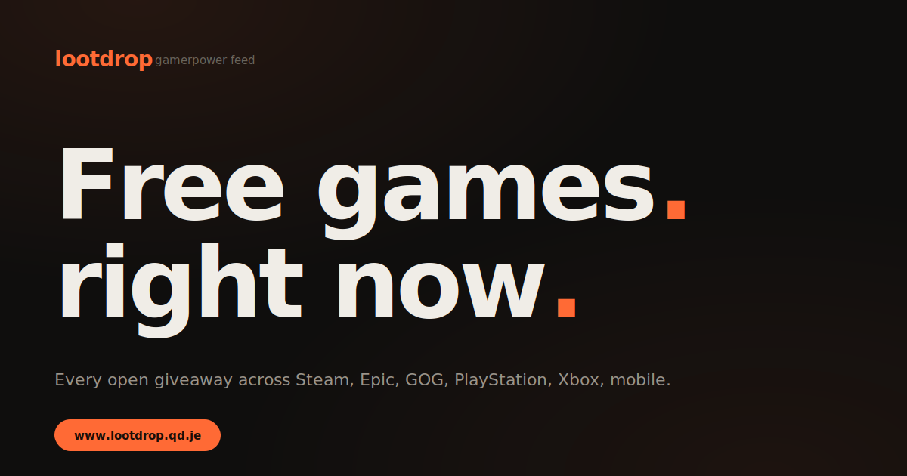

# Loot Drops

A live web feed of free games — combining time-limited **giveaways** (Steam keys, DLC, beta invites) from [GamerPower](https://www.gamerpower.com/api-read) with permanently **free-to-play** games from [FreeToGame](https://www.freetogame.com/api-doc). One grid, one design language, two data sources you can toggle between.

**Live:** [www.lootdrop.qd.je](https://www.lootdrop.qd.je)



## Features

- **Two feeds under one roof** — tab between "Live giveaways" and "Free-to-play games"; each has its own hero, filters, sort options, and card treatment
- **Filter popover** — category, platform, and saved-only in a single dropdown with an active-filter count badge
- **Search + sort** — client-side title search, plus sort by newest, value, popularity, ending-soon, or A–Z (source-aware)
- **Save for later** — tap the star on any card to bookmark it; persisted to `localStorage` and namespaced across sources
- **Random pick** — one-click surprise-me button that scrolls to and pulses a coral spotlight on a random card from the current filter
- **Rarity tiers** — giveaway cards worth $40+ fill with the accent color so the top drops leap out of the grid
- **Load-more pagination** — first 60 cards render immediately, the rest lazy-load on demand
- **Dark & light themes** — token-based, honors OS preference, toggle persists
- **Privacy-respecting analytics** via Cloudflare Web Analytics — no cookies, no consent banner

## Stack

- **Vite 8** + **React 19** — static SPA, no backend
- **GamerPower API** + **FreeToGame API** — data sources, both unauthenticated and CORS-open
- **Cloudflare Pages** — hosting + SSL, auto-deploys on push to `main`
- **deSEC.io** DNS + **DigitalPlat FreeDomain** — custom subdomain
- **Cloudflare Web Analytics** — traffic stats
- **Agentation** — dev-only in-page annotation tool for the design loop (tree-shaken from production)

## Run locally

```bash
git clone https://github.com/theloyaltrojan/lootdrop
cd lootdrop
npm install
npm run dev
```

Dev server binds to `http://localhost:5173`. Push to `main` triggers a Cloudflare Pages rebuild in ~30 seconds.

## Design notes

Warm-dark ground (`#0f0e0d`) with a single coral accent (`#ff6a35`), geometric heavy-weight system sans throughout, rounded pill controls, hairline borders. The favicon, wordmark, hero periods, legendary card fills, save stars, and random-spotlight glow all share the same accent so the brand reads as one system rather than a palette.

The tier system on giveaway cards (common → rare → legendary) is data-driven — encoded from the giveaway's `worth` field rather than decorative — so the coral fill on legendary cards actually means something.

## License

MIT — do what you want with it.
